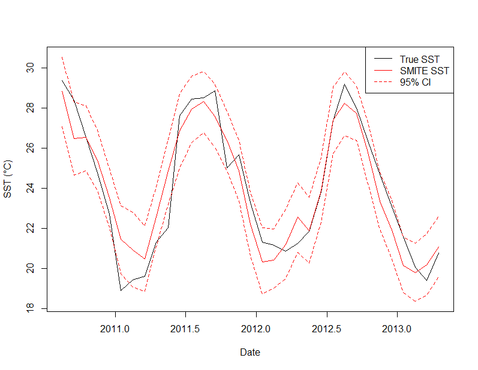

<!-- README.md is generated from README.Rmd. Please edit that file -->

# SMITER: An R Package to SMITE Coral

<!-- badges: start -->
<!-- badges: end -->

## Introduction

The goal of SMITER is to allow for easy access of the SMITE Method, a
multivariate method for reconstructing sea surface temperature (SST) and
seawater pH using coral skeletal geochemistry. You can find more details
about the SMITE method in the forthcoming paper (Hughes et al., in
press). In a sentence, SMITE leverages the covariance of multiple coral
geochemical signals (e.g., Sr/Ca, Li/Mg) to optimize reconstruction
skill. While SMITE is ready for widespread dissemination, it is also in
active development. See guidelines below for contributing.

## Installation

You can install the development version of SMITER from
[GitHub](https://github.com/) with:

``` r
install.packages("devtools")
devtools::install_github("hphughescraft/SMITER")
```

## Usage

The SMITER package comes with two primary functions:
[SMITE.calib()](https://hphughescraft.github.io/SMITER/reference/SMITE.calib.html)
and
[SMITE.recon()](https://hphughescraft.github.io/SMITER/reference/SMITE.recon.html).
A typical workflow will go as follows.

### Calibration

First, you want to call the SMITER package and load your data into R.
The SMITER package comes with sample data from Hughes et al. (in press)
for you to work with.

``` r
# Call the SMITER package
library(SMITER) 

# Load data (e.g., sample data from the SMITER package)
data(BMDA_1B_Comp) # Data
data(BMDA_1B_EComp) # Errors
```

Next, you will want to designate a forward matrix (A), a reconstruction
target (b), and the corresponding errors in both (Ae, be).

``` r
proxy_names <- c('BCa', 'SrCa', 'MgCa', 'UCa', 'LiCa', 'LiMg', 'd11B')

A <- bmda_1b_comp[,proxy_names]
Ae <- bmda_1b_ecomp[,proxy_names]
b <- bmda_1b_comp[,'Temp']
be <- rep(0.02, length(b))
```

Now you can execute a SMITE calibration.

``` r
SMITE <- SMITE.calib(A = A, b = b, Ae = Ae, be = be, eigenclean = ncol(A))
```

Now I can create a plot to compare the SMITE SST reconstruction to true
SST using this chunk of code.

``` r
Date <- bmda_1b_comp$Date

# Base plot #
plot(x = Date, y = b, type = 'l', ylab = 'SST (\u00B0C)', 
     ylim = c(min(SMITE$recon$bhat.low), max(SMITE$recon$bhat.high))
     )
     
# Add SMITE reconstruction # 
lines(x = Date, y = SMITE$recon$bhat.mu, col = 'red')
lines(x = Date, y = SMITE$recon$bhat.high, col = 'red', lt = 'dashed')
lines(x = Date, y = SMITE$recon$bhat.low, col = 'red', lt = 'dashed')

# Add legend #
legend("topright", 
       legend = c("True SST", "SMITE SST", "95% CI"), 
       col = c("black", "red", "red"),
       lty = c(1, 1, 2),
       title = NULL
)
```



Note that this function will make a few assumptions regarding your
calibration. First, it will assume that the errors you provided are
uncorrelated (noise = ‘white’). If your errors are correlated, set the
‘noise’ argument to ‘red’ and provide the value of the lag-1
autocorrelation coefficient in the ‘acc’ argument.

Second, the function uses a bootstrap Monte Carlo approach to estimate a
confidence interval on your singular values (S), your model parameters
(x), and your predicted values for the reconstruction target (bhat or
recon). You can specify the parameters of this Monte Carlo approach
through the ‘it’ and ‘alpha’ arguments. See the
[SMITE.calib()](https://hphughescraft.github.io/SMITER/reference/SMITE.calib.html)
reference page for more details.

### Reconstruction

Finally, you can reconstruct the environmental variable (in this case,
SST) using the SMITE.recon() function on the forward matrix.

``` r
reconstruction <- SMITE.recon(
  A = A,
  x = SMITE$x$x.mu,
  Amu = colMeans(A),
  Asd = apply(A, 2, function(x) sd(x)),
  bmu = mean(b),
  bsd = sd(b)
)
```

Note that this function does not include a bootstrap Monte Carlo error
estimation (yet). At minimum, the SEP estimated during calibration can
be used to provide a measure of precision in your estimates. We also
recommend using the mean and standard deviation of the calibration
period in particular when reconstructing environmental variables beyond
the calibration period. This is to ensure that changes relative to the
calibration period are accurately captured.

## Contributing

Thank you for considering contributing to this project! While I am the
sole developer of this R package, your feedback, bug reports, and
feature requests are greatly appreciated.

### Reporting Issues

If you encounter any bugs, have questions, or would like to suggest
improvements, please [open an
issue](https://github.com/hphughescraft/your-package-name/issues) on
GitHub. Provide as much detail as possible, including any error messages
or steps to reproduce the issue.

### Feedback and Feature Requests

Have an idea for a new feature or improvement? Feel free to [open an
issue](https://github.com/hphughescraft/your-package-name/issues) to
share your thoughts. I welcome feedback and ideas for making this
package better.

### Getting Support

If you need help using the package or have general questions, please
feel free to reach out to me directly via
[email](mailto:your@email.com). I’m here to help!

### Code Modifications

As the sole developer of this project, I am responsible for maintaining
and updating the codebase. While I appreciate suggestions and feedback,
I kindly ask that you refrain from making direct modifications to the
code on GitHub. If you have a specific feature request or bug fix that
you’d like to see implemented, please open an issue to discuss it.

Thank you for your understanding and support!

## Acknowledgements

I would like all of those who have contributed to improving the SMITE
method thus far, particularly my coauthors for the SMITE methods paper
(Hughes et al., in press). A huge thanks goes to the
[pkgdown](https://pkgdown.r-lib.org/) package in R for making this
method so easy to disseminate. A special thanks goes Matt Jansen for
advising me in the subtleties of website design.
